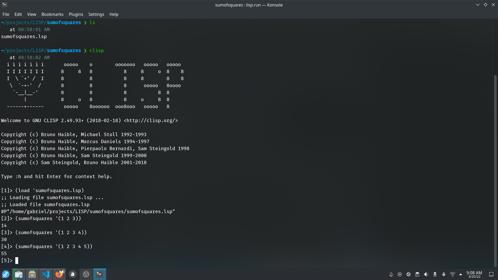

# SUM OF SQUARES

Ini adalah program yang dibuat dengan bahasa pemrograman LISP, yang berfungsi sebagai bahan pembelajaran dan untuk menghitung jumlah dari pangkat dua setiap elemen dari sebuah list of integer yang diberikan.

Berikut link video pembuatannya: <button><a href="https://youtu.be/8fy5WdOQAGQ">Klik Disini </a></button>

## How to use?

Berikut cara menggunakan program ini:
1. Buka CLISP.
2. Load program ini.
3. Ketikkan
    ```
    (sumofsquares '(list yang ingin kalian masukkan))
    ```
    Contohnya:
    ```
    (sumofsquares '(1 2 3 4))
    ```
4. Tekan enter dan hasilnya akan muncul.



## <b>About Me</b>

I'm a student at Del Institute of Technology. <br>
Bachelor of Informatics study program. <br>


<button><a href="https://www.instagram.com/gabrielhtg77/">My Instagram</a></button>
<br>
<button><a href="https://www.del.ac.id/">Institut Teknologi Del</a></button>
